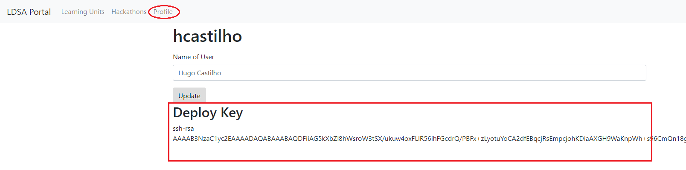

# Batch 5 Students Repository

Welcome to **Lisbon Data Science Academy Batch 5** Students repository! 

Your first step in this journey is to **carefully read** the steps in this tutorial. You'll learn:

- How to set up your environment;
- The weekly workflow to follow during the Academy

1. [Initial Setup](#initial-setup)
    1. [Windows 10 Setup](#Windows-10-Setup)
    1. [MacOS Intel Setup](#MacOS-Intel-Setup)
    1. [MacOS M1 Setup](#MacOS-M1-Setup)
    1. [Ubuntu Setup](#Ubuntu-Setup)
    1. [Setup for all Operating Systems](#Setup-for-all-Operating-Systems)
    1. [Setup Git and GitHub](#Setup-Git-and-GitHub)
    1. [Setup your Workspace Repository](#setup-your-workspace-repository)
    1. [Get the Learning Material](#get-the-learning-material)
    1. [Running and Submitting a Learning Unit](#running-and-submitting-a-learning-unit)
    1. [Add your Slack ID to the Portal](#Add-your-Slack-ID-to-the-Portal)
1. [Learning Unit Workflow](#learning-unit-workflow)
1. [Updates to Learning Units](#updates-to-learning-units)
1. [Help](#help)
    1. [Learning Unit](#learning-unit-workflow)
    1. [_Portal_](#_portal_)
    1. [Troubleshooting](#Troubleshooting)
    1. [Other](#other)

<br>

## Initial Setup

<br>

### Windows 10 Setup

This section deals with setting up Windows Subsystem for Linux (WSL) on Windows 10.
If you are using MacOS or Linux you can skip this section.

**Why do I need to install WSL?**

Because of the differences in command line syntax between Windows vs Mac OS/Linux, it would be a great challenge for us to support and provide instructions for both Operating Systems. For this reason, we’d ask you to install Windows Subsystem for Linux which enables you to run Linux command lines inside Windows. Keep in mind that these are simply extensions to your Windows operating system, hence, installing this software will not do any changes on your laptop. It is also quick to do so.

**Step 1:** Follow **[this guide](guides/Windows_Subsystem_for_Linux_Installation_Guide_for_Windows_10.md)** to setup WSL on Windows 10.

**Step 2:** Open a terminal (remember **[this](guides/Windows_Subsystem_for_Linux_Installation_Guide_for_Windows_10.md#Opening-the-WSL-terminal)**!!) and run the following command:

```bash
sudo apt update && sudo apt upgrade && sudo apt install git
```

**Step 3:** Open a terminal (remember **[this](guides/Windows_Subsystem_for_Linux_Installation_Guide_for_Windows_10.md#Opening-the-WSL-terminal)**!!) and check if you already have `python3.7` by usind the command below. If your version is `Python 3.7.x` (`x` = any number), you can skip to step 4, otherwise continue with step 3.1 and 3.2

```bash
python3.7 --version
```
**Step 3.1:** Run the following commands to setup _Python 3.7_ (if you get an error with this command, check [this](#6-When-setting-up-python-3.7-i-get-an-error)
):

```bash
sudo add-apt-repository ppa:deadsnakes/ppa
```

**Step 3.2:** Run the following commands to install _Python 3.7_

```bash
sudo apt update && sudo apt install python3.7 -y
```

**Step 4** Run the following command to get `pip` and `venv`:
```bash
sudo apt update && sudo apt upgrade && sudo apt install python3-pip python3.7-venv -y
```
>**Why do we install these?**
>
> We'll be using `pip` which is the reference Python package manager. You should always use a virtual environment to install python packages. We'll use `venv` to set them up.

<br>

### MacOS Intel Setup

Some of the steps in the following sections will require _Homebrew_ for MacOS.
Homebrew will make it easier to install software that we will use later on.

**Step 1:** To open the terminal, choose one:
* In Finder , open the /Applications/Utilities folder, then double-click Terminal.
* By pressing <kbd>cmd</kbd> + <kbd>space</kbd> then type `terminal` and press <kbd>enter</kbd>.

    The terminal should now be open:

    

**Step 2:** To install Homebrew for MacOS, copy and paste the following line in the terminal:

```bash
/bin/bash -c "$(curl -fsSL https://raw.githubusercontent.com/Homebrew/install/master/install.sh)"
```

**Step 2.1:** Sometimes it's necessary to install xcode command line utils. To do so, do the following command before installing homebrew:

```bash
xcode-select --install
```

You may be prompted to install the _Command Line Developers Tools_. Confirm and, once it finishes, continue installing _Homebrew_ by pressing <kbd>enter</kbd> again.

**Step 3:** open a terminal and run the following command:

```bash
brew update --verbose
```

**Step 4:** then run the following command:

```bash
brew install git
```

**Step 5:** then run the following command:

```bash
brew install python@3.7
```

**Step 6:** then run the following command:

```bash
brew link python@3.7
```

<br>

### MacOS M1 Setup

So you got the new M1 and you're supper happy with how fast it is.. Unfortunately dealing with apple silicon requires a little
get around. You no longer have a intel chip and most things are available for intel. But don't worry, we'll be able to get there in the end.

**Step 1:** To open the terminal, choose one:
* In Finder , open the /Applications/Utilities folder, then double-click Terminal.
* By pressing <kbd>cmd</kbd> + <kbd>space</kbd> then type `terminal` and press <kbd>enter</kbd>.

    The terminal should now be open:

    

<br>

**Step 1.1:** To use intel-based software, you'll need Rosetta2. Most of you should already have it installed for varied reasons. If you don't simply run the following line in the terminal:

```bash
softwareupdate --install-rosetta
```

This will launch the rosetta installer and you’ll have to agree to a license agreement.


**Step 2:** To install Homebrew x86 version, aka `ibrew` for MacOS, copy and paste the following line in the terminal:

```bash
arch -x86_64 /bin/bash -c "$(curl -fsSL https://raw.githubusercontent.com/Homebrew/install/master/install.sh)"
```

**Step 2.1:** Sometimes it's necessary to install xcode command line utils. To do so, do the following command before installing homebrew:

```bash
xcode-select --install
```

**Step 3:** Add an alias with `ibrew` to your $PATH

```bash
echo 'alias ibrew="arch -x86_64 /usr/local/bin/brew"' >> ~/.zshrc
```

**Step 4:** Activate the alterations done to .zshrc
```bash
source ~/.zshrc
```

**Step 5:** Install python 3.7 with `ibrew`

```bash
ibrew install python@3.7
```

**Step 6:** Add python 3.7 to $PATH

```bash
export PATH="/usr/local/opt/python@3.7/bin:$PATH" >> ~/.zshrc
```

**Step 7** Re-activate the alterations done to .zshrc
```bash
source ~/.zshrc
```

<br>

### Ubuntu Setup

So you're using Ubuntu, hun? Well, kudos to you. You just need to install a couple of packages.


**Step 1:** Open a terminal and check what version of Python you have by using the command below. If your version is `Python 3.7.x` (`x` = any number), you can skip to step 2, otherwise continue with step 1.1 and 1.2

```bash
python3.7 --version
```

**Step 1.1:** Run the following commands to setup _Python 3.7_ (if you get an error with this command, check [this](#6-When-setting-up-python-3.7-i-get-an-error)
):

```bash
sudo add-apt-repository ppa:deadsnakes/ppa
```

**Step 1.2:** Run the following commands to install _Python 3.7_

```bash
sudo apt update && sudo apt install python3.7 -y
```

**Step 2** Run the following command to get `pip` and `venv`:
```bash
sudo apt update && sudo apt upgrade && sudo apt install python3-pip python3.7-venv -y
```

>**Why do we install these?**
>
> We'll be using `pip` which is the reference Python package manager. You should always use a virtual environment to install python packages. We'll use `venv` to set them up.

<br>

### Setup for all Operating Systems

#### Creating a Python Virtual Environment

Bellow are the instructions that are enough to get the setup done and get you up and running :)
You can also follow [this guide](guides/How_to_set_up_python_virtual_environments.md) for a more in depth set of instructions that accomplish exactly the same thing.

You should always be using a virtual environment to install python packages. We'll use _venv_ to set them up.

To install and update packages, we'll be using _pip_ which is the reference Python package manager.

**Step 1** Start by installing ensuring pip, setuptools, and wheel are up to date:

```bash
python3 -m pip install --user --upgrade pip setuptools wheel
```

**Step 2** Create a virtual environment with the name `slu00`

```bash
python3 -m venv ~/.virtualenvs/slu00
```

**Step 3** Activate the environment

```bash
source ~/.virtualenvs/slu00/bin/activate
```

>Note: after you activate your virtual environment you should see at the leftmost of your command line the name of your virtual environment surrounded by parenthesis, like this:

```bash
mig@my-machine % source ~/.virtualenvs/slu00/bin/activate
(slu00) mig@my-machine %
```

And you're able to make sure your virtual environment is active using the `which` command (it outputs the location of your virtual environment's python installation):

```bash
(slu00) mig@my-machine % which python
/Users/mig/.virtualenvs/slu00/bin/python
```

**Step 4** Now update pip.

```bash
(slu00) pip install -U pip
```

### Setup _Git_ and _GitHub_

Having a _GitHub_ account and knowing the basics of committing and pushing changes are mandatory for this academy.

**If you don't have a _GitHub_ account, complete the following steps:**

1. [Sign up](https://github.com/join) for a _GitHub_ account if you don't
already have one.
1. [Checking for existing SSH keys](https://help.github.com/en/github/authenticating-to-github/checking-for-existing-ssh-keys)
1. [Generating a new SSH key and adding it to the ssh-agent](https://help.github.com/en/github/authenticating-to-github/generating-a-new-ssh-key-and-adding-it-to-the-ssh-agent)
1. [Adding a new SSH key to your GitHub account](https://help.github.com/en/github/authenticating-to-github/adding-a-new-ssh-key-to-your-github-account)
1. [Testing your SSH connection](https://help.github.com/en/github/authenticating-to-github/testing-your-ssh-connection)


### Setup your Workspace Repository

The workspace directory/repository is where you will place everything you
are working on, solve exercises, make changes to files, etc. In this academy that is a requirement as it is how you will make your work available to us.

#### Creating the Workspace

1. Log into _GitHub_
1. Create a new **private** _GitHub_ repository called *batch5-workspace*, see
[Creating a new repository](https://help.github.com/en/articles/creating-a-new-repository).
**IMPORTANT** The repo **MUST** be named *batch5-workspace*!
If you name it anything else, you will be unable to submit any of your work!
    1. You need to explicitly select **Private** - This is your work and nobody else's.
    You will be graded based upon the merits of what you are able to do here
    so this should not be open to the world while you are working
    on it.
    Maybe after the course is completed, you can open-source it but not this
    time.
    1. Initialize with a README.
    This is mostly just so that you don't initialize an empty repo.
    1. Add a Python `.gitignore`.
    This step is insanely important. If you don't do this, you may
    end up checking things into the repo that make it un-gradeable by our
    grading system.
    ADD THE `.gitignore` PLEASE!!!! <--- 4 * `!` isn't enough


#### Add a Deploy Key to your Repository

Since the repository is private you will have to explicitly give access so
that our grading system can fetch the repository.
To do this you will be adding a deploy key to the repository, which we
provide to you in our [_Portal_](https://portal.lisbondatascience.org/).

1. Head on to the [_Portal_](https://portal.lisbondatascience.org/)
1. Log in with your _GitHub_ account
1. Go to your [profile](https://portal.lisbondatascience.org/users/info/) and
copy the deploy key (including the `ssh-rsa` part)

1. Go back to the repository you have just created
1. Go to `Settings > Deploy Keys`
1. Click "Add deploy key" (no need to grant Write Access)
1. Give it a recognizable name like "grader" and paste the key from the
_Portal_


#### Cloning the Workspace

1. Open a Terminal or Git Bash, the next steps are on this terminal
1. Clone your `<username>/batch5-workspace` repository

    > If you're not sure where to clone the repository in, you can create a `~/projects` folder, and clone it there

```bash
git clone git@github.com:<username>/batch5-workspace.git
```

### Get the Learning Material

You will be cloning the [batch5-students](https://github.com/LDSSA/batch5-students)
repository.
All of the learning material you need will be made available on this repo
as the academy progresses.

1. Open a Terminal or Git Bash, the next steps are on this terminal
1. Clone the students repository
[batch5-students](https://github.com/LDSSA/batch5-students)

```bash
git clone https://github.com/LDSSA/batch5-students.git
```

Or if you have your ssh keys set up:

```bash
git clone git@github.com:LDSSA/batch5-students.git
```

### Running and Submitting a Learning Unit

In the `batch5-students` repository that you just cloned there is a sample
learning unit.
It's used to give instructors guidelines to produce the learning units.
We are also using it to ensure that you are able to run and submit a learning
unit.

So go ahead and copy the sample directory `sample/SLU00 - LU Tutorial` from the `batch5-students` repository to your repository (named `batch5-workspace`).


The grader only requires you to have the contents in a directory starting with
the learning unit's ID, but we highly advise to keep the same directory
structure as the students repository.
All learning units are organized as:

```markdown
<specialization ID> - <specialization name>/<learning unit ID> - <learnin unit name>
```

Doing so will help you keep organized and ease copying data from the students
repository to yours.

#### Working on the Learning Unit

All learning units come as a set of Jupyter Notebooks (and some links to
presentations).
Notebooks are documents that can contain text, images and live code that you
can run interactively.

In this section we will launch the Jupyter Notebook application.
The application is accessed through the web browser.

Once you have the application open feel free to explore the sample learning
unit structure.
It will give you a handle on what to expect and what rules the instructors
follow (and the effort they put) when creating a learning unit.

So let's start the Jupyter Notebook app:

1. Activate your virtual environment

    ```bash
    source ~/.virtualenvs/slu00/bin/activate
    ```

1. Enter the Learning unit directory in your workspace directory (`batch5-workspace`).
    >Note: It is **VERY IMPORTANT** that you **ALWAYS** work on the files on your `batch5-workspace` repository, and **NEVER** work on files that are in your `batch5-students` repository!

    ```bash
    cd ~/projects/batch5-workspace/sample/"SLU00 - LU Tutorial"
    ```

1. Installing the necessary packages

    ```bash
    pip install -r requirements.txt
    ```

1. Run the jupyter notebook
    >**Windows 10 note:** if you are running **Windows 10** with WSL, the command to run the jupyter notebook is: `jupyter notebook --NotebookApp.use_redirect_file=False`

    ```bash
    jupyter notebook
    ```

When you run the `jupyter notebook` command, you should see something similar to this in your terminal:

Your browser should pop up with Jupyter open, however, if this does not happen, you can simply copy the link you see on your terminal (the one that contains `localhost`) and past it in your browser's address bar:


>Note: If you see these scarry looking error messages, don't worry, you can just ignore them.


##### The Exercise Notebook

Make sure you open and go through the Learning Notebook first.

Every learning unit contains an exercise notebook with exercises you will
work on.
So let's have a look at the sample Learning Unit.

1. On the Jupyter Notebook UI in the browser open the exercise notebook

1. Follow the instructions provided in the notebook

Besides the exercises and the cells for you to write solutions you will see
other cells with a series of `assert` statements.
This is how we (and you) will determine if a solution is correct.
If all `assert` statements pass, meaning you dont get an `AssertionError` or
any other kind of exception, the solution is correct.

Once you've solved all of the notebook we recommend the following this simple
checklist to avoid unexpected surprises.

1. Save the notebook (again)
1. Run "Restart & Run All"

1. At this point the notebook should have run without any failing assertions

If you want to submit your notebook before it is all the way done to
check intermediate progress, feel free to.

If you are able to go through the entire process and get a passing grade on
the sample LU you'll have a good understanding of the same flow that you'll use
for all LUs throughout the academy.

#### Commit and Push

Now you have worked on the sample learning unit and you have some uncommitted
changes.
It's time to commit the changes, which just means adding them to your `batch5-workspace`
repository history, and pushing this history to you remote on _GitHub_.

* Using the terminal commit and push the changes

```bash
git add .
git commit -m 'Testing the sample notebook'
git push
```

#### Grading

1. Go to the [_Portal_](https://portal.lisbondatascience.org) and select the learning unit

1. Select "Grade"

1. After grading is complete you should have 20/20
1. If everything passes locally but the grader doesn't give you the excepted
output head to out [troubleshooting](#_portal_)

## Learning Unit Workflow

You will need to follow this workflow whenever new learning materials are released.

Learning units will be announced in the academy's _#announcements_ channel.
At this point they are available in the
[batch5-students](https://github.com/LDSSA/batch5-students)
repository.
A new Learning Unit is released every Monday, and its
solutions are then released the next Monday.

The steps you followed during the initial setup are exactly what you are going
to be doing for each new Learning Unit.
Here's a quick recap:

1. Once a new Learning Unit is available, pull the changes from the [batch5-students](https://github.com/LDSSA/batch5-students) repo:
    * enter the `~/projects/batch5-students/` using the `cd` command, then use the `git pull` command:

    ```bash
    cd ~/projects/batch5-students/
    git pull
    ```

1. Copy the Learning Unit to your `batch5-workspace` repo

    ```bash
    cp -r ~/projects/batch5-students/"<specialization ID> - <specialization name>"/"<learning unit ID> - <learnin unit name>" ~/projects/batch5-workspace/"<specialization ID> - <specialization name>"
    ```

    For example, for the `S01 - Bootcamp and Binary Classification` and `SLU01 - Pandas 101`, it would look like this:

    ```bash
    cp -r ~/projects/batch5-students/"S01 - Bootcamp and Binary Classification"/"SLU01 - Pandas 101" ~/projects/batch5-workspace/"S01 - Bootcamp and Binary Classification"
    ```

1. Create a new virtual environment for the Learning Unit you'll be working on.

    * To do this you will run the following command:

    ```bash
    python3 -m venv ~/.virtualenvs/<learning unit ID>
    ```

    * and you would replace the `<learning unit ID>` with the learning unit ID, such that for SLU01, for example, the command would be:

    ```bash
    python3 -m venv ~/.virtualenvs/slu01
    ```

1. Activate your virtual environment

    ```bash
    source ~/.virtualenvs/slu01/bin/activate
    ```

1. Install the python packages from requirements.txt for the specific Learning Unit (you must do this for each Learning Unit, and there are multiple Learning Units in a Specialization)

    ```bash
    pip install -r ~/projects/batch5-workspace/"<specialization ID> - <specialization name>"/"<learning unit ID> - <learnin unit name>"/requirements.txt
    ```

    For example, for the `S01 - Bootcamp and Binary Classification` and `SLU01 - Pandas 101`, it would look like this:

    ```bash
    pip install -r ~/projects/batch5-workspace/"S01 - Bootcamp and Binary Classification"/requirements.txt
    ```

1. Change to the `batch5-workspace` dir

    ```bash
    cd ~/projects/batch5-workspace
    ```

1. Open Jupyter Notebook

    ```bash
    jupyter notebook
    ```

1. Work
1. Once all tests pass or once you're happy, save your work, close the browser tab with the Jupyter Notebook, close the terminal and open a new terminal
1. Then commit the changes and push

    ```bash
    cd ~/projects/batch5-workspace
    git add .
    git commit -m "Worked on SLU01 exercises"
    git push
    ```

1. Profit

## Updates to Learning Units

As much as we try and have processes in place to prevent errors and bugs in
the learning units some make it through to you.
If the problem is not in the exercise notebook you can just pull the new
version from the students repo and replace the file.
The problem is if the correction is in the exercise notebook, you can't just
replace the file your work is there and you'll lose it!

When a new version of the exercise notebook is released (and announced) two
things will happen.
If you submit an old version of the notebook it will be flagged as out of date
and not graded.
You will have to merge the work you've already done into the new version of the
notebook.

At the moment our suggestion to merge the changes is:

1. Rename the old version
1. Copy the new exercise notebook over
1. Open both and copy paste your solutions to the new notebook

We understand it's not ideal and are working on improving this workflow using
[_nbdime_](https://nbdime.readthedocs.io/).
If you are comfortable installing _Python_ packages you can try it out, but
we offer no support for this at the moment.

### Add your Slack ID to the Portal

Besides your *GitHub Handle*, you should add your **SlackID to the portal**. You can find information on how to find it [following this link](https://moshfeu.medium.com/how-to-find-my-member-id-in-slack-workspace-d4bba942e38c)

## Help

During the academy you will surely run into problems and have doubts about the
material.
We provide you with some different channels to ask for help.

### Learning Unit

If you feel something is not clear enough or there is a bug in the learning
material please follow [these steps](https://ldssa.github.io/wiki/Students/How-to-ask-for-and-give-help/). Remember, there is no such thing as a dumb question, and by asking questions publicly you will help others!

If you have more conceptual questions about the materials or how to approach a problem you can also
reach out to the instructors on slack.
You can find the main contact for the learning unit in the
[_Portal_](https://portal.lisbondatascience.org/) this instructor can help you
out or redirect you to someone that is available at the moment.

### _Portal_

Are you getting different results locally than what you are getting in the
_Portal_?
If so we will first ask to do a bit of troubleshooting.

1. Ensure that you have saved the changes in the notebook
1. Ensure that you have committed and pushed the changes
1. Ensure that you are not using packages that are not present in the original
`requirements.txt` file (changes to this file or your local environment have no
effect)
1. In the learning unit page in the [_Portal_](https://portal.lisbondatascience.org/)
you are able to download the exercise notebook with the results of the grader
by clicking your grade, have a look to figure out what went wrong.

If none of these steps helped go ahead and open a support ticket for the portal
[here](https://github.com/LDSSA/batch5-students).

Is the _Portal_ down or acting out in some unexpected way?
Then please open a support ticket for the portal
[here](https://github.com/LDSSA/batch5-students).

### Troubleshooting

1. [When I open Windows Explorer through Ubuntu it goes to a different folder than in the guide](#When-I-open-Windows-Explorer-through-Ubuntu-it-goes-to-a-different-folder-than-in-the-guide)
1. [Ubuntu on Windows 10 high CPU usage crashes](#Ubuntu-on-Windows-10-high-CPU-usage-crashes)
1. [When I pull from the `batch5-students` repository I get an error](#When-I-pull-from-the-batch5-students-repository-I-get-the-error)
1. [When I try to open `jupyter notebook` I get an error](#When-I-try-to-open-jupyter-notebook-I-get-the-error)
1. [When I use the `cp` command the `>` sign appears and the command does not execute](#When-I-use-the-`cp`-command-the->-sign-appears-and-the-command-does-not-execute)
1. [When setting up python 3.7 I get an error](#When-setting-up-python-3.7-i-get-an-error)
1. [Nothing happens when I type my password](#Nothing-happens-when-I-type-my-password)
1. [I still have a NotImplemented error](#I-still-have-a-NotImplemented-error)
1. [My problem is not listed here what should I do?](#My-problem-is-not-listed-here-what-should-I-do?)

#### When I open Windows Explorer through Ubuntu it goes to a different folder than in the guide

Please make sure:

* you are running the command `explorer.exe .` including the dot at the end.
* you are running Windows 10 version `1909` or newer.

#### Ubuntu on Windows 10 high CPU usage crashes

* First please make sure you are running Windows 10 version `1909` or newer.
* Then, try following [these steps](https://teckangaroo.com/enable-windows-10-virtual-machine-platform/)

#### When I pull from the `batch5-students` repository I get the error

```bash
error: Your local changes to the following files would be overwritten by merge:
<some files>
Please commit your changes or stash them before you merge.
Aborting
```

_git_ is telling us that changes were made by you to the files on the `~/projects/batch5-students` folder, and is not pulling the changes made by the instructors because they would override the changes that you made there. To fix this do the following:

1. make sure that any change you made to the files on `~/projects/batch5-students`  (that you want to not lose) is saved in your `~/projects/batch5-workspace` repository (see `https://github.com/LDSSA/batch5-students#updates-to-learning-units` for how to do this), and if you don't want to keep the changes you made to these files, just continue on to the next step
2. go to the `~/projects/batch5-students` folder and run:

    ```bash
    cd ~/projects/batch5-students
    git stash
    ```

3. now you can pull from the `batch5-students` repository:

    ```bash
    git pull
    ```

#### When I try to open `jupyter notebook` I get the error

```bash
migs-MBP% jupyter notebook
zsh: command not found: jupyter
```

Before opening `jupyter notebook` activate your virtual environment:

```bash
source ~/.virtualenvs/slu00/bin/activate
```

#### When I use the `cp` command the `>` sign appears and the command does not execute

```bash
cp -r ~/projects/batch5-students/"S01 - Bootcamp and Binary Classification"/"SLU01 - Pandas 101" ~/projects/batch5-workspace/"S01 - Bootcamp and Binary Classification"
>
```

Make sure to use this type of quotes `"` and not these ones `“`.

#### When setting up python 3.7 I get an error

When I run this command:

```bash
sudo add-apt-repository ppa:deadsnakes/ppa
```

I get this error:

```bash
W: GPG error: http://apt.postgresql.org/pub/repos/apt focal-pgdg InRelease: The following signatures couldn't be verified because the public key is not available: NO_PUBKEY 7FCC7D46ACCC4CF8
```

Solution: Take the id in front of `NO_PUBKEY` (in my case its `7FCC7D46ACCC4CF8`) and run the following command:

```bash
sudo apt-key adv --keyserver keyserver.ubuntu.com --recv-keys 7FCC7D46ACCC4CF8
```

#### Nothing happens when I type my password

In **step two** it asks me for the computer password. However, I am not being able to write anything

Solution:
When you write your password you might not get any visual feedback and that's okay! Write it as normal and hit <kbd>enter</kbd> when you're done!

#### I still have a NotImplemented error

I've completed the exercise in the Exercise Notebook but when I run the cell I get a **NotImplementedError**.

Solution:
The `raise NotImplementedError()` are added to the exercise cell as a placeholder for where you're supposed to add your solution/code. It is meant to be removed!

#### My problem is not listed here what should I do?

If the above steps didn't solve the problem for you, please contact us on Slack or [open an issue](https://guides.github.com/features/issues/) in this repo.

### Other

If your problem doesn't fit in any  of the previous categories head over to slack and ask.
Someone will surely point you in the right direction.

If you're looking for some specific part of our organization head over to the
[Member Directory](https://ldssa.github.io/wiki/About%20us/Member-Directory/)
and search for the area of responsibility you're looking for.
