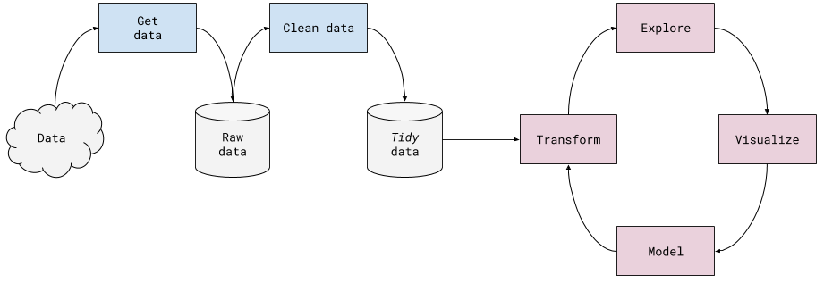

# Big Learning Unit 2 - Advanced Wrangling
## What is in this BLU?
**Main topics**

1. Creating tidy datasets
    - Workflow to get multiple datasets into one
    - concat, merge
    - group-apply-combine
    - inner and outer, left join
2. Pipelines & Transformers

**Summary**

Welcome to the Data Wrangling specialization. Here you'll learn about the Data Science Workflow. 
In the last BLU we focused in the two first steps of the workflow (the blue boxes in the image), now you will get an idea of the entire pipeline.

Good luck!

## How to go through this BLU

1. Follow the [Learning Unit Workflow](https://github.com/LDSSA/batch4-students#learning-unit-workflow) to setup your environment.
1. Go through the Learning Notebooks (there's three of them).
1. Do the Exercise notebook, and submit it on [the portal](https://portal.lisbondatascience.org), as usual.

## "I need help understanding something"

You can and should ask for help, be it about Learning Notebooks, Exercises, or anything else. Please checkout the [How to Ask for Help](https://github.com/LDSSA/wiki/wiki/How-to-ask-for-and-give-help), and remember not to share code when asking for help about the exercises! 

## About the data

The New York Philharmonic played its first concert on December 7, 1842.

The data documents all known concerts, amounting to more than 20,000 performances.

The [Leon Levy Digital Archives](https://archives.nyphil.org/) provides an interface for searching printed programs alongside other digitized items.

We organized the performances as follows:

* The Program is the top-most level element in our dataset
* A Program is defined as performances in which the repertoire, conductors, and soloists are the same
* A Program is associated with an Orchestra (e.g., New York Philharmonic) and a Season (e.g., 1842-43)
* A Program may have multiple Concerts with different dates, times and locations
* A Program's repertoire may contain numerous Works (e.g., two different symphonies by Beethoven)
* A Work can have multiple Soloists (e.g., Mahler on the harpsichord, Strauss or Bernstein on the piano or Isadora Duncan listed as a dancer).

## Data dictionary

### Programs

Programs are under `/data/programs/`, arranged by season (i.e., each season as a separate `{season}.csv` file).

| Variable      | Type [dtype]    | Meaning                             |
| :-------------|:----------------| :-----------------------------------|
| GUID          | string [object] | Leon Levy Digital Archives ID       |
| ProgramID     | int [int64]     | Local NYP ID                        |
| Orchestra     | string [object] | Full orchestra name                 |
| Season        | string [object] | Sep 1 - Aug 31, displayed "1842-43" |

### Concerts

| Variable  | Type [dtype]    | Meaning                                                                        |
| :---------|:----------------| :------------------------------------------------------------------------------|
| GUID      | string [object] | Leon Levy Digital Archives ID                                                  |
| ProgramID | int [int64]     | Local NYP ID                                                                   |
| ConcertID | int [int64]     | Concert ID, for same program                                                   |
| EventType | float [float64] | NYP event type                                                                 |
| Location  | string [object] | Geographic location of concert                                                 |
| Venue     | string [object] | Name of hall, theater, or building where the concert took place                |
| Date      | string [object] | Full ISO date used, but ignore TIME part (1842-12-07T05:00:00Z = Dec. 7, 1842) |
| Time      | string [object] | Actual time of concert, e.g. "8:00PM"                                          |

### Works

| Variable      | Type [dtype]    | Meaning                            |
| :-------------|:----------------| :----------------------------------|
| GUID          | string [object] | Leon Levy Digital Archives ID      |
| ProgramID     | int [int64]     | Local NYP ID                       |
| WorkID        | int [int64]     | NYP Work ID                        |
| MovementID    | float [float64] | NYP Movement ID                    |
| ComposerName  | string [object] | Composer: Last name, First name    |
| WorkTitle     | string [object] | TITLE (NYP short titles used)      |
| Movement      | string [object] | Movement title as cataloged by NYP |
| ConductorName | string [object] | Conductor: Last name, First name   |
| Interval      | string [object] | Interval tag                       |

### Soloists

| Variable          | Type [dtype]    | Meaning                                                         |  
| :-----------------|:----------------| :---------------------------------------------------------------|
| GUID              | string [object] | Leon Levy Digital Archives ID                                   |
| ProgramID         | int [int64]     | Local NYP ID                                                    |
| WorkID            | int [int64]     | NYP Work ID                                                     |
| MovementID        | float [float64] | NYP Movement ID                                                 |
| SoloistName       | string [object] | Soloist: Last name, First name                                  |
| SoloistInstrument | string [object] | Soloist instrument played, singing voice or type of performance |
| SoloistRole       | string [object] | "S" means "Soloist"; "A" means "Assisting Artist"               |
