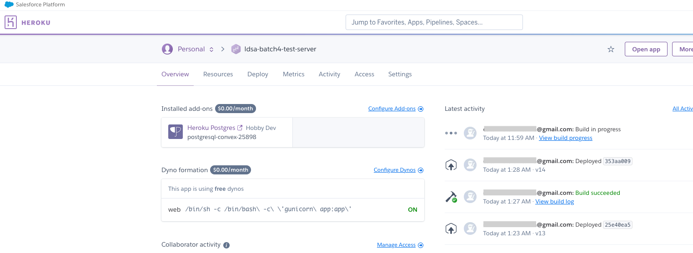
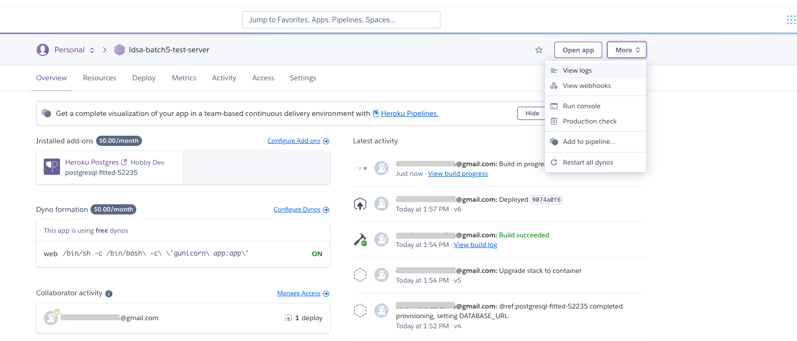
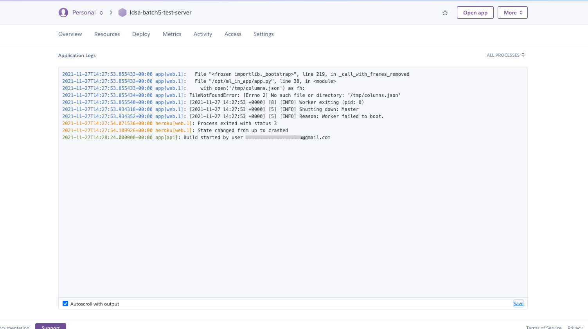
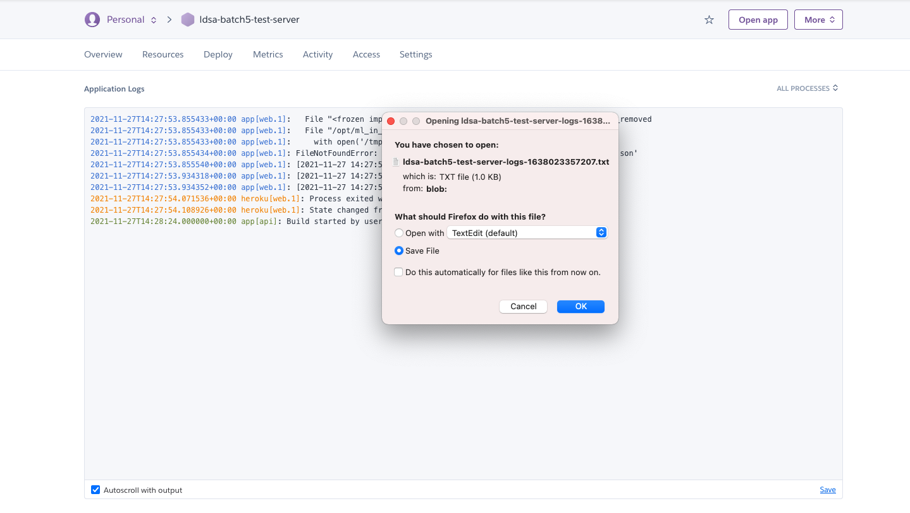

# Checking logs in heroku

Oftentimes, when you explore new features and add complexity to your server, as we 
are doing in this BLU by adding validations to input, you make mistakes and cause the
app to crash. Now, we've covered the need for tests in the learning notebooks but even
with that it may just be that something falls through the cracks.

As such, it's important to be able to check the app is running and, in case it's not,
understand why. For this last case, we typically make use of logging. You 
will cover logging better in BLU15, so we won't talk about that in-depth. However, this is 
a small guide to enable you to debug a bit better your apps.

For more information on heroku logging check [this](https://devcenter.heroku.com/articles/logging#view-logs).

## Procedure to check logs in heroku

#### Step 1 - Access heroku app

First, start by going to heroku and accessing your app. You should be familiar
with this view by now:

#### Step 2 - Logs menu

Once you are on heroku's platform,  click "More" on the upper right menu. 
You should see an option saying "View logs". Click it to jump to the logs page:

## Step 3 - Check database

You should see the following window:

## Step 4 - Saving your logs [Optional]

You can also save your logs by clicking the lower right button on the page:

