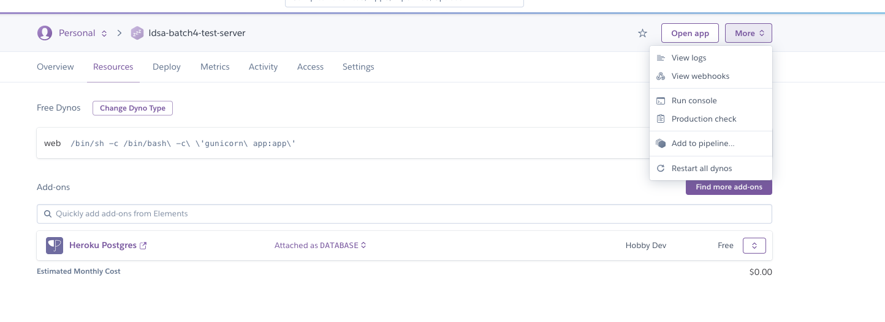

# Resetting your postgres database in heroku

As you are developing your server and launching on the same environment, there may be 
a few occasions where you want to reset your database, i.e, clean it from any data
and start from scratch. Some situations where you may want to do this:

* You realized your model had mistakes - like missing fields or wrong fields - and you
want to redo it
* You were playing around with dummy data and you want to clean it up
* You were testing it and are reaching the row limit (since we're using the heroku free tier)

In any case, this is a procedure that may come in handy for you.

## Procedure to reset db in heroku

#### Step 1 - Access heroku app

First, start by going to heroku and accessing your app. You should be familiar
with this view by now:

#### Step 2 - Resources tab

Once you are on heroku's platform, jump on to the "Resources" tab. You should see listed 
your database as "Heroku Postgres".

## Step 3 - Check database

Click on the database row from the resources page. Once you do you should see 
some information and stats about your database, for example, the number
of rows it has.

## Step 4 - Click "Reset" button

Jump to "Settings". Here you should see the option to reset your database. Click it and wait for 
the page to reload.

## Step 5 - Check message

You should see a message similar to the one below, indicating a successful reset:

## Step 6 - Restart app

Finally, jump back to the initial view and click "More" on the upper
right menu. You should see an option saying "Restart all dynos". Click
it to restart the app:

