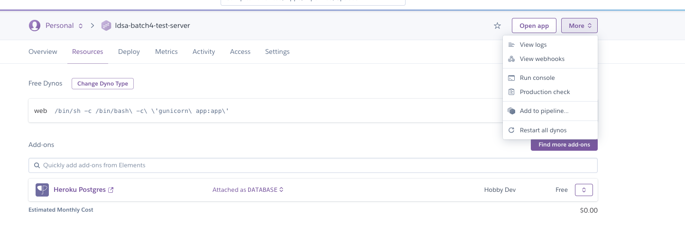

# Restart your heroku app

Restarting your heroku app is super simple and can be done directly
from heroku's interface. Access heroku through your browser and sign
in. Once you are in the app view, click "More" on the upper right menu. You should see an option saying "Restart all dynos". 
Click it to restart the app:

After a couple of minutes, your app should be back up!

